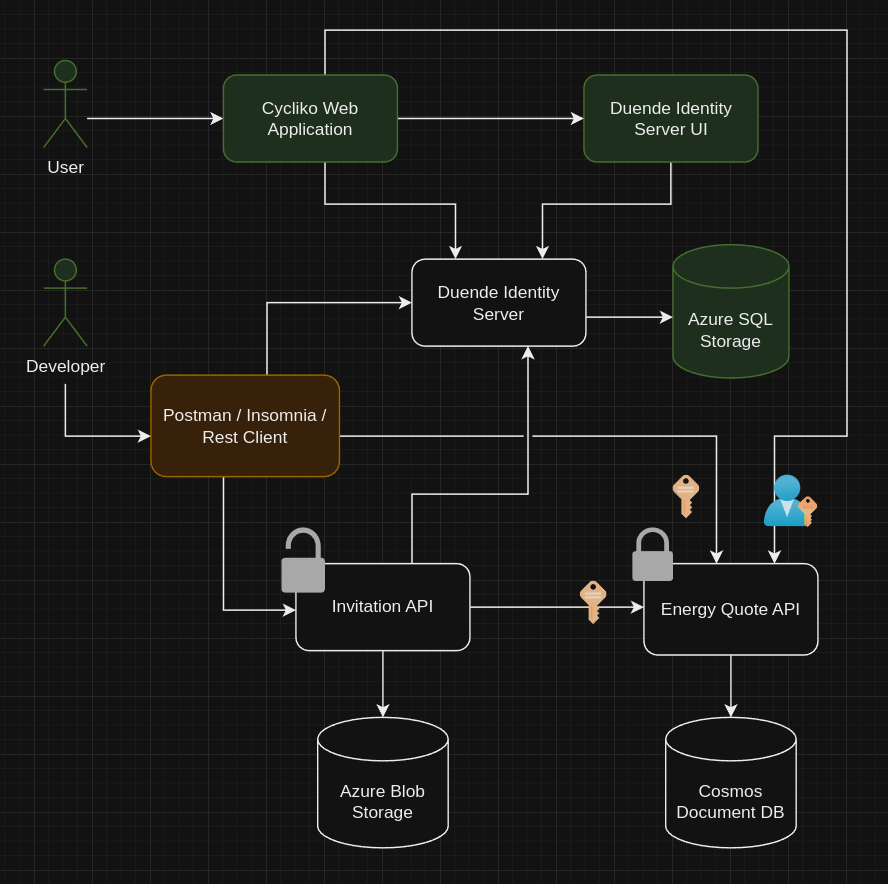

## Introduction 
Cycliko Web Application For Managing Cycling Teams, Races, Riders and Organize Races. A multi-service .NET demo Proof of Concept project for Azure deployment. (HoGent Web 4 final project).

## Purpose of this Repository
- Showing implementation of multiple-service Rest-Api's
- Showing usage of cloud-based storage service's:
    - Relational
    - Document-based
    - Blob
- Showing best practices of :
    - SOLID principles
    - Object Oriented Programming
    - Clean Architecture
    - Microservice architecture

## Design
### Architecture
The situation we want to achieve looks as follows:


### Used technologies:
- ASP.NET 8
- Azure Blob Storage
- Azure Cosmos DB
- Azure SQL Database
- Duende Identity Server


## Build and run

If you want to run projects locally use [CosmosDB Emulator](https://learn.microsoft.com/en-us/azure/cosmos-db/how-to-develop-emulator?tabs=docker-linux%2Ccsharp&pivots=api-nosql) and [Azurite](https://learn.microsoft.com/en-us/azure/storage/common/storage-use-azurite?tabs=visual-studio%2Cblob-storage) (usually already installed with Visual Studio)

1. Configure appsettings.json files to provide connection strings, credentials, secret tokens and URL's

2. Start services
    - If you use VSCode just run in each project folder location with Program.cs

        ```bash
        dotnet run
        ```
    - If you use Visual Studio follow [this link to set multiple startup projects](https://learn.microsoft.com/en-us/visualstudio/ide/how-to-set-multiple-startup-projects?view=vs-2022)


## Deployment
For manual deployment run in each project folder this CLI command:

```bash
az webapp up `
  --name your_azure_web_application_project_name `
  --plan your_azure_plan `
  --resource-group your_azure_resource_group `
  --location westeurope `
  --os-type linux
```


## Contribute
 - Feel free to download/clone/fork this repository.
 - [Submit bugs, describe isues](https://github.com/rafalhogent/cycliko_azure/issues)

